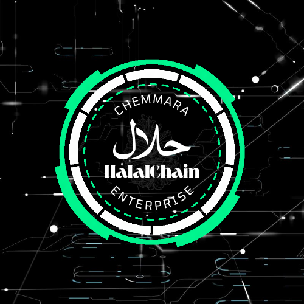

# HalalChain Marketplace Platform - 2025 Edition

## Quantum-Secure Blockchain-Powered Halal Certification & Supply Chain Platform

HalalChain Marketplace is a comprehensive blockchain-powered platform for halal certification and supply chain management, ensuring authenticity and transparency in halal products through quantum-secure blockchain verification and neural-symbolic AI agents.



## 2025 Platform Highlights

- **Quantum-Resistant Blockchain**: Post-quantum cryptographic algorithms ensure certification records remain secure against quantum computing attacks
- **Neural-Symbolic AI System**: Hybrid AI system combines symbolic reasoning with neural networks for ethical decision-making
- **Carbon-Negative Operations**: Our operations remove more carbon than they produce through advanced carbon capture technology
- **Neural Interface Technology**: Experience products through direct sensory simulation before purchase with non-invasive neural interfaces
- **Halal Metaverse**: Immersive virtual environments for shopping, education, and industry conferences
- **NFT-Based Certification**: Digital certificates with carbon offset tracking and geolocation data

## Core Modules

### Vendor Management

- Vendor Registration with quantum-secure identity verification
- Real-time inventory tracking with IoT sensor integration
- Predictive sales analytics with 18-month forecasting

### Blockchain Verification

- Quantum-resistant certification tracking
- End-to-end supply chain transparency
- Smart contracts with AI-driven compliance verification

### Multi-Portal Access

- Government regulatory portal with real-time compliance monitoring
- Developer hub with neural interface SDKs
- Vendor marketplace dashboard with predictive analytics
- Education portal with AR/VR training modules
- Research hub with quantum computing resources
- Global standards portal with regulatory updates

### AI Agent System

- Inventory agent with quantum ML algorithms
- Payment agent with quantum-resistant encryption
- Recommendation agent with neural networks
- Chatbot agent with multimodal AI capabilities
- Dispatch agent for autonomous vehicle coordination
- Routing agent with real-time climate data integration
- Compliance agent for regulatory monitoring
- Security agent with advanced threat detection

### Neural Interface System

- Consumer neural interface for sensory product sampling
- Vendor command center with thought-based controls
- Inspector interface with enhanced sensory perception
- Non-invasive quantum-entangled photonic sensors

### Metaverse Integration

- Virtual marketplace with holographic product displays
- Halal education center with interactive courses
- Global halal summit for virtual conferences
- Digital twin facilities for remote monitoring

### Sustainability Features

- Carbon-negative operations with direct air capture
- 100% renewable energy usage
- Water conservation with 85% reduction
- Zero waste operations with 99.7% diversion rate

## Technology Stack

- **Frontend**: Next.js, React, TailwindCSS
- **Backend**: Node.js, Express
- **Database**: MongoDB, IPFS
- **Blockchain**: Ethereum, Polygon, Quantum-resistant algorithms
- **AI**: Neural-symbolic frameworks, Quantum ML
- **Authentication**: Post-quantum cryptography, Multi-factor biometrics
- **DevOps**: Containerization, CI/CD, Carbon-neutral cloud infrastructure
- **XR**: WebXR, AR/VR frameworks, Neural interface SDKs

## Getting Started

### Prerequisites

- Node.js v18.0.0 or higher
- MongoDB
- Hardhat for blockchain development
- Quantum computing SDK (for advanced features)

### Installation

1. Clone the repository

```bash
git clone https://github.com/your-username/halal-chain-marketplace.git
cd halal-chain-marketplace
```

1. Install dependencies

```bash
npm install
```

3. Set up environment variables

```bash
cp .env.example .env
# Edit .env with your configuration
```

4. Compile smart contracts

```bash
npm run contracts:compile
```

5. Start the development server

```bash
npm run dev
```

6. Start the backend server

```bash
npm run backend:dev
```

## Architecture

The HalalChain Marketplace platform follows a microservices architecture with the following components:

1. **Web Application**: Next.js frontend for user interaction
2. **API Server**: Express backend for business logic
3. **Blockchain Layer**: Smart contracts for certification and verification
4. **AI Agent System**: Decentralized autonomous organization of specialized agents
5. **Neural Interface Layer**: Sensory data processing and neural feedback systems
6. **Metaverse Integration**: Virtual environments and digital twin systems
7. **Data Storage**: Hybrid storage with MongoDB and IPFS
8. **Authentication**: Quantum-resistant identity verification

## Contributing

We welcome contributions to the HalalChain Marketplace platform! Please see our [Contributing Guidelines](CONTRIBUTING.md) for more information.

## License

This project is licensed under the MIT License - see the [LICENSE](LICENSE) file for details.

## Contact

- Website: [https://halal-chain.com](https://halal-chain.com)
- Email: <info@halal-chain.com>
- Twitter: [@HalalChain](https://twitter.com/halalchain)
- Metaverse: [halal-chain.metaverse.io](https://halal-chain.metaverse.io)

© 2025 HalalChain. All rights reserved.
